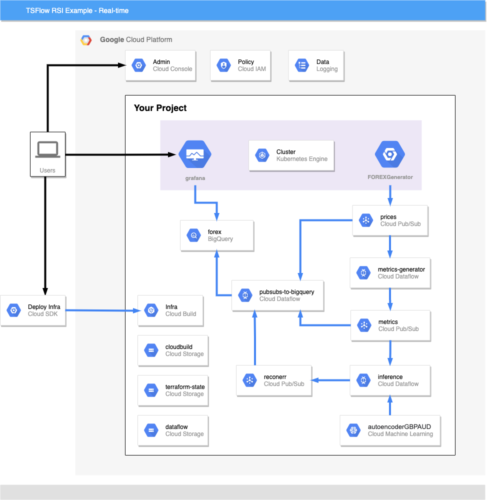
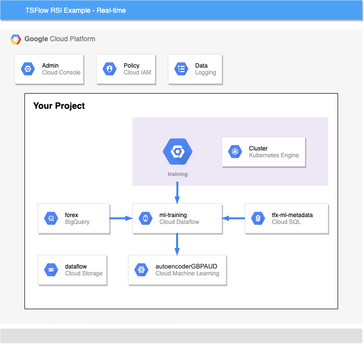

# TSFlow RSI Example

This project is an example of how to detect anomalies in financial, technical indicators by modeling their expected distribution and thus inform when the Relative Strength Indicator (RSI) is unreliable. RSI is a popular indicator for traders of financial assets, and it can be helpful to understand when it is reliable or not. This is achieved using realistic foreign exchange market data and leverages Google Cloud Platform and the TSFlow library. 

The TSFlow library is a fast, flexible library for processing time-series data -- particularly for financial market data due to its large volume. Its ability to perform data engineering and generate useful metrics in real-time significantly reduces the time and effort to build machine learning models and solve problems in the finance domain.

This example uses GCP infrastructure, including Dataflow, Pub/Sub, BigQuery, Kubernetes Engine, and AI Platform.

## Quickstart

**On a laptop (Mac or Linux or WSL)**
To get running quickly,
1. Create a new project in GCP
1. Install `gcloud` and set PROJECT_ID
1. Run the `deploy-infra.sh` to create base infrastructure, this will take 5-10mins
1. Run the `run-app.sh` to deploy the pipelines and model, this will take 5mins
1. View the grafana dashboard

**Run on Cloud Shell**
You can also run this example using Cloud Shell. To begin, login to the GCP console and select the “Activate Cloud Shell” icon in the top right of your project dashboard. Then run the following:
1. Clone the repo: `git clone https://github.com/kasna-cloud/tsflow-rsi-example.git && cd tsflow-rsi-example`
1. Run the infrastructure deployment: `./deploy-infra.sh`, this will take 5-10mins
1. Run the pipeline deployment: `./run-app.sh`, this will take 5mins

## Problem Domain 

The Relative Strength Index, or RSI, is a popular financial technical indicator that measures the magnitude of recent price changes to evaluate whether an asset is currently overbought or oversold.

The rule of thumb regarding RSI is:
When RSI for an asset is less than 30, traders should buy this asset as the price is expected to increase in the near future.
When RSI for an asset is greater than 70, traders should sell this asset as the price is expected to decrease in the near future.

As this is a rule of thumb, this strategy cannot be trusted to work favourably at all times. Therefore in these instances (i.e. RSI > 70 or RSI < 30), it would be useful to know if RSI is a reliable indicator to inform a trade or not.

We propose, for a given asset, that RSI is a reliable indicator when metrics describing the same asset (e.g. log returns) are behaving as they usually do when RSI > 70 or RSI < 30. And therefore, RSI is unreliable to inform a trade when these metrics are behaving anomalously.

To detect when RSI is reliable or not for a given asset, the modelling approach is as follows. We train an anomaly detection model to learn the expected behaviour of metrics describing the asset when RSI > 70 or RSI < 30. When an anomaly is detected (and RSI > 70 or RSI < 30), the model is informing that these input metrics are behaving differently to how they usually behave when RSI > 70 or RSI < 30. And so in these instances, RSI is not reliable and a trade is not advised. If no anomaly is detected, then the metrics are behaving as expected when RSI > 70 or RSI < 30, so you can trust RSI and make a trade.

## Design Principles
The key design principles used in the creation of this example are:
- Keep data unobfuscated between components to ease inspection and increase flexibility
- Ensure consistency in data by using a shared module for all transformations
- Use managed services, minimise infrastructure management overheads
- Ensure hermetic seal code paths between training and inference pipelines, the code in our example is shared between training and inference

## Repo
This repo is organised into folders containing logical functions of the example. A brief description of these are below:
- **app/bootstrap_models** is the LSTM model pre-populated with the example so that dashboards can immediately render RSI values. This model is updated by the re-training data pipeline.
- **app/grafana** contains visualization configuration
- **app/java** holds the Dataflow pipeline code using the TSFlow library. This pipeline creates metrics from the prices stream.
- **app/kubernetes** has deployment manifests for starting the Dataflow pipelines, prices generator and retraining job.
- **app/python** is a containerized python program for:
    - inference and retraining pipelines
    - pubsub to bigquery pipeline 
    - forex generator to create realistic prices
- **docs** folder contains further example information and diagrams
- **infra** contains the cloudbuild and terraform code to deploy the example GCP infrastructure
- **notebooks** folder has detailed AI Notebooks which step through the RSI use case from a Data Science perspective 

## Components 

This example can be thought of in two distinct, logical functions. One for real-time ingestion of prices and determination of RSI presence, and another for the re-training of the model to improve prediction.

The logical diagram for the real-time flow through the GCP components is below.

The logical re-training flow is in the following diagram.

### Storage Components
* Three PubSub Topics: prices, metrics, and reconerr
* One BigQuery Dataset with 3 Tables: 
    * prices
    * metrics
    * reconerr
* One AI Platform Model
* One Cloud SQL Database for ML Metadata

### Compute Components
* Autopilot GKE Cluster: 
    * price generator deployment
    * grafana deployment
    * tfx retraining pipeline cron job, and a singleton job to start dataflow streaming pipelines
* Dataflow streaming pipelines:
    * Metrics Library (Java) 
    * Inference Pipeline (Python)
    * 3x PubSub-to-BigQuery Pipelines (Python)
* Dataflow batch pipline:
    * Re-training pipeline created dynamically by TFX when the GKE cronjob is run (every hour)

### Deployment
This example is deployed in two steps:
1. infrastructure into GCP by CloudBuild and terraform
2. application and pipeline deployment using CloudBuild

Both of these CloudBuild steps can be triggered using the `deploy-infra.sh` and `run-app.sh` scripts and require only a [gcloud](https://cloud.google.com/sdk) Google Cloud SDK to be installed locally.

If needed, this example can be run using GCP Cloud Shell. Please refer to the Quickstart section for further information.

